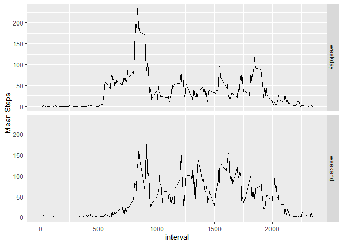

## Loading and preprocessing the data


```r
library(tidyverse)
```

```
## -- Attaching packages --------------------------------------- tidyverse 1.3.0 --
```

```
## v ggplot2 3.3.2     v purrr   0.3.4
## v tibble  3.0.4     v dplyr   1.0.2
## v tidyr   1.1.2     v stringr 1.4.0
## v readr   1.4.0     v forcats 0.5.0
```

```
## -- Conflicts ------------------------------------------ tidyverse_conflicts() --
## x dplyr::filter() masks stats::filter()
## x dplyr::lag()    masks stats::lag()
```

```r
activityData <- read.csv("activity.csv")
activityData$date <- as.Date(activityData$date, "%Y-%m-%d")
activityData <- tibble(activityData)
```

## What is mean total number of steps taken per day?


```r
stepSummary <- activityData %>% 
  group_by(date) %>% 
  summarise(totalSteps = sum(steps, na.rm = TRUE), .groups = "keep")
meanSteps <- mean(stepSummary$totalSteps)
medianSteps <- median(stepSummary$totalSteps)
hist(stepSummary$totalSteps, main = "Total steps per day", xlab = "Steps")
```

<!-- -->

The mean number of steps taken per day was 9354.2295082.

The median number of steps taken per day was 10395.


## What is the average daily activity pattern?


```r
stepSummary <- activityData %>%
  group_by(interval) %>%
  summarise(meanSteps = mean(steps, na.rm = TRUE), .groups = "keep")
plot(stepSummary$interval, 
     stepSummary$meanSteps, 
     type = "l", 
     main = "Activity Pattern", 
     xlab = "Time Interval", 
     ylab = "Average Steps")
```

<!-- -->

```r
maxInterval <- stepSummary$interval[which.max(stepSummary$meanSteps)]
```
The 5 minute interval with the most steps was 835

## Imputing missing values


```r
missingRows <- sum(!complete.cases(activityData))
```
2304 entries are missing from the data.

To impute the missing values I will use the mean value for that interval as calculated in the last section.


```r
imputedActivityData <- activityData

for(i in 1:nrow(imputedActivityData)) {
  if(is.na(imputedActivityData[i, "steps"])) {
    missingIndex <-
      which(stepSummary$interval == imputedActivityData$interval[i], 
            arr.ind = TRUE)
    
    imputedActivityData[i, "steps"] <- 
      as.integer(stepSummary$meanSteps[missingIndex])
  }
}

stepSummary <- imputedActivityData %>% 
  group_by(date) %>%
  summarise(totalSteps = sum(steps, na.rm = TRUE), .groups = "keep")

meanSteps <- mean(stepSummary$totalSteps)
medianSteps <- median(stepSummary$totalSteps)
```

The mean number of steps of the imputed data set is 10749.77. Because we imputed the mean based on the interval's average, not the day's average, this value is expected to be different than the previous mean. 

The median of the imputed data set is 10641. By imputing using the interval mean we introduced the same value into the data set multiple times. This resulted in a change to the median.

## Are there differences in activity patterns between weekdays and weekends?

```r
activityData <- activityData %>% 
  add_column(weekday = rep("Null", times = nrow(activityData)))
isWeekday = as.numeric(format.Date(activityData$date, "%u")) < 6
activityData$weekday[isWeekday] <- "weekday"
activityData$weekday[!isWeekday] <- "weekend"
activityData$weekday <- as.factor(activityData$weekday)

activityData <- activityData %>% 
  group_by(interval, weekday) %>%
  summarise(meanSteps = mean(steps, na.rm = TRUE), .groups = "keep")

ggplot(data = activityData, aes(interval, meanSteps)) + 
  geom_line() + 
  facet_grid(weekday ~.) +
  labs(y = "Mean Steps")
```

<!-- -->


