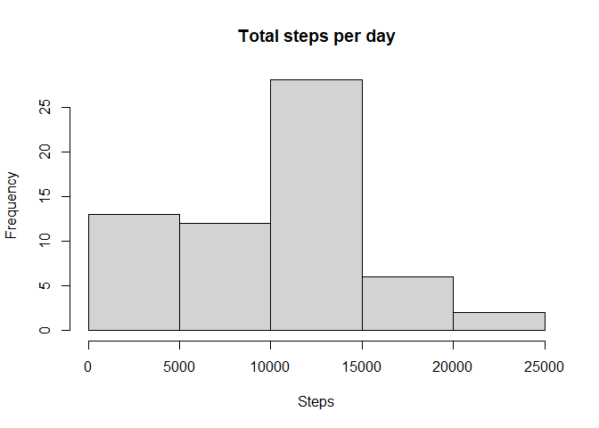
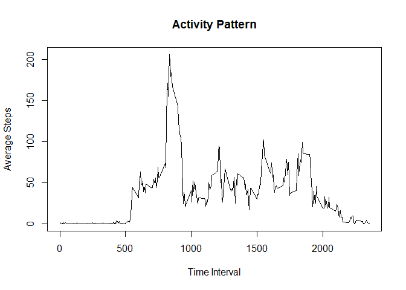

## Loading and preprocessing the data


```r
library(dplyr)
```

```
## 
## Attaching package: 'dplyr'
```

```
## The following objects are masked from 'package:stats':
## 
##     filter, lag
```

```
## The following objects are masked from 'package:base':
## 
##     intersect, setdiff, setequal, union
```

```r
library(ggplot2)

activityData <- read.csv("activity.csv")
activityData$date <- as.Date(activityData$date, "%Y-%m-%d")
```

## What is mean total number of steps taken per day?


```r
groupedByDate <- group_by(activityData, date)
stepSummary <- summarise(groupedByDate, 
                         totalSteps = sum(steps, na.rm = TRUE), 
                         .groups = "keep")
meanSteps <- mean(stepSummary$totalSteps)
medianSteps <- median(stepSummary$totalSteps)
hist(stepSummary$totalSteps, main = "Total steps per day", xlab = "Steps")
```

<!-- -->

The mean number of steps taken per day was 9354.2295082.

The median number of steps taken per day was 10395.


## What is the average daily activity pattern?


```r
groupedByInterval = group_by(activityData, interval)
stepSummary <- summarise(groupedByInterval, 
                         meanSteps = mean(steps, na.rm = TRUE), 
                         .groups = "keep")
plot(stepSummary$interval, 
     stepSummary$meanSteps, 
     type = "l", 
     main = "Activity Pattern", 
     xlab = "Time Interval", 
     ylab = "Average Steps")
```

<!-- -->

```r
maxInterval <- stepSummary$interval[which.max(stepSummary$meanSteps)]
```
The 5 minute interval with the most steps was 835

## Imputing missing values


```r
missingRows <- sum(!complete.cases(activityData))
```
2304 entries are missing from the data.

To impute the missing values I will use the mean value for that interval as calculated in the last section.


```r
imputedActivityData <- activityData

for(i in 1:nrow(imputedActivityData)) {
  if(is.na(imputedActivityData[i, "steps"])) {
    imputedActivityData[i, "steps"] <- 
      stepSummary$meanSteps[which(stepSummary$interval == imputedActivityData$interval[i], arr.ind = TRUE)]
  }
}

groupedByDate <- group_by(imputedActivityData, date)
stepSummary <- summarise(groupedByDate, totalSteps = sum(steps, na.rm = TRUE))
```

```
## `summarise()` ungrouping output (override with `.groups` argument)
```

```r
meanSteps <- mean(stepSummary$totalSteps)
medianSteps <- median(stepSummary$totalSteps)
```

The mean number of steps of the imputed dataset is 10766.19. Because we imputed the mean based on the interval's average, not the day's average, this value is expected to be different than the previous mean. 

The median of the imputed dataset is 10766.19. By imputing using the interval mean we introduced the same value into the dataset multiple times. This resulted in the median matching the mean.

## Are there differences in activity patterns between weekdays and weekends?

